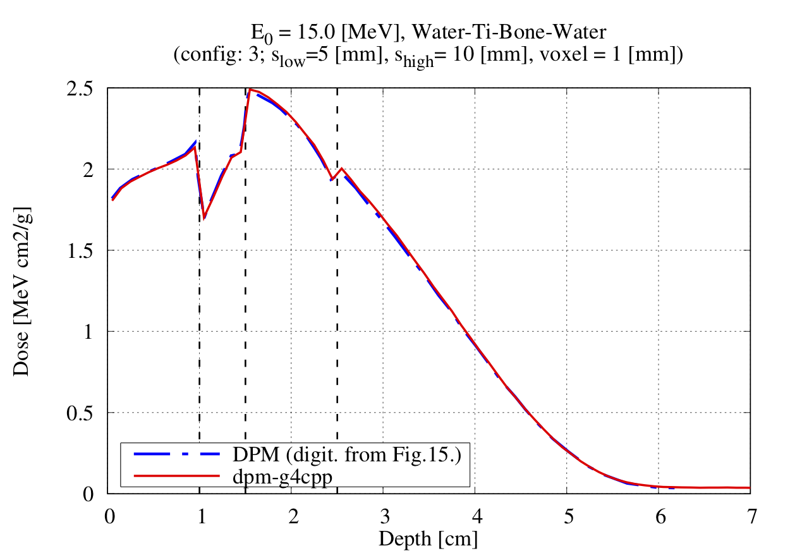

# The `dpm-g4cpp` R&D

## Motivation

The motivations behind this project are:
 - provide a clean, well documented `C++` implementation of the well known, highly specialised *Dose Planning Method* (DMP)[1] Monte Carlo simulation that can be a basis for further GPU/FPGA developments
 - in order to make the original DPM like simulation more suitable for these hardware, eliminate all possible non-deterministic loops from the simulation, especially those related to the final state generation of the individual interactions
 - this project also serves as *testbed* for studying the possible benefits of the related treatment of the description of e-/e+ Multiple Coulomb Scattering (MSC) over the traditional models
 - especially that the DPM like handling of MSC is very efficient and stays accurate (without paying any computing performance penalties) even in the case of highly granular geometries
 - this latter is due to the fact that this simulation algorithm was designed and optimised for efficient and accurate modelling of particle transport through multiple, small geometry voxels

## Description

`dpm-g4cpp` is a `C++` prototype of the known *Dose Planning Method* (DMP)[1], fast and accurate Monte Carlo simulation. DMP is highly optimised for photon and electron radiotherapy treatment planning dose calculations based on a data extraction and simulation phase.

These two phases are also preserved and clearly separated in the `dpm-g4cpp` version:
 - `dpm_GenerateData` : can be used to generate and write into files all the data that are needed for the later simulation phase. Since some of the data (the integrated data such as IMFP, dE/dx, etc.) are generated based on `Geant4`, this part requires a recent `Geant4` (version >= 10.7.p01) installed on the system.
 - `dpm_Simulate` : can be used to perform the dose simulation relying on the previously generated data files. One of the main difference between the original DPM and `dpm-g4cpp` that this latter simulation dose not contain any non-deterministic loops (rejection loops) during the interaction computation including even the sampling of angular deflections along a given path length according to the *Goudsmit Saunderson* angular distributions or the emitted bremsstralung photon energy according to the numerical Seltzer-Berger DCS. These makes `dpm-g4cpp` a suitable prototype for GPU/FPGA hardware implementations since the main thread divergence factors have been eliminated form the original DPM simulation.

## Build

As mentioned before, the data generation and simulation phases are well separated. Since the data generation part depends on `Geant4`, a relatively recent version (>= Geant4-10.7p01) of the `Geant4` simulation toolkit needs to be available on the system. See the **[Geant4 Installation Guide](https://geant4-userdoc.web.cern.ch/UsersGuides/InstallationGuide/html/index.html)** for further instruction.

It is assumed in the followings, that the required version of the ``Geant4`` toolkit is installed on the system and the corresponding ``Geant4Config.cmake`` ``CMake`` configuration file is located under the ``G4_INSTALL`` directory. Then building and installing ``G4HepEm`` (under the ``G4HepEm_INSTALL`` directory) can be done by simple:

    $ git clone https://github.com/mnovak42/dpm-g4cpp.git    
    $ cd dpm-g4cpp
    $ mkdir build
    $ cd build/
    $ cmake ../ -DGeant4_DIR=G4_INSTALL
    $ make

## Example: the data generation phase

Then the generated `dpm_GenerateData` executable can be used to generate all the files that are needed for a given simulation. The following information is reported when executing with `-h` (help) flag:

    $ ./dpm_GenerateData -h

    ===============================================================================================
     The dpm-g4cpp pre-init/data generation phase.

     Usage: dpm_GenerateData [OPTIONS]

     -d  --input-data-dir      (where the pre-generated data will be written)  - default: ./data
     -c  --configuration-index (one of the pre-defined configuration settings) - default: 0
     -h  --help

    ===============================================================================================

Note, that there are several pre-defined simulation configurations available for the fast settings of some reference configurations given in [1]. See the `Configuration.hh` and the `Simulation/Geom.hh` files for further details. The pre-defined simulation configuration with the index of `3` will be used in the following: this will be used to simulate the depth dose distribution in a `Water-Titanium-Bone-Water` geometry shown in Fig.15. of [1] (and below). The corresponding data files will be generated into a
newly created local `data_WaterTiBoneWater` directory:

    bash-3.2$ mkdir data_WaterTiBoneWater
    bash-3.2$ ./dpm_GenerateData -c 3 -d data_WaterTiBoneWater  

 
 <b>Expand for the output!</b> 

    === The dpm-g4cpp data generation configuration:

        - output data directory : data_WaterTiBoneWater
        - configuration index   : 3

    === Pre-init/data generation configuration:
         - Min-Ekin          : 0.001  [MeV]
         - Max-Ekin          : 21  [MeV]
         - #Ekins for e-     : 128
         - #Ekins for gamma  : 1024
         - cut for e-        : 0.2  [MeV]
         - cut for gamma     : 0.05  [MeV]
         - MSC step param    :
                s-low    = 5  [mm]
                s-high   = 10  [mm]
                e-cross  = 12 [MeV]
         - pre-defined geom. : 3
         - materials         :
                [0] = G4_WATER
                [1] = G4_Ti
                [2] = G4_BONE_COMPACT_ICRU
    ...............................................

    === Data are generated now (don't care about the
        Geant4 warning: 'WARNING from G4PenelopeIonisationModel...')

   WARNING from G4PenelopeIonisationModel
   Atomic de-excitation module is not instantiated, so there will not be any fluorescence/Auger emission.
   Please make sure this is intended

    === All data have been generated and will be written now
        into files under the directory: data_WaterTiBoneWater

## Example: the simulation phase

After having all the required data generated, the `dpm_Simulate` executable can be used to perform
the dose simulation in the previously selected configuration. The simulation configuration can be
specified by the input arguments. Executing `dmp_Simulate` with the `-h` (help) flag provides the
following information regarding the input arguments:

    $./dpm_Simulate -h

    =================================================================================================
     The dpm-g4cpp simulation phase.

     Usage: dpm_Simulate [OPTIONS]

   	-p  --primary-particle    (possible particle names: e-, gamma)            - default: e-
   	-e  --primary-energy      (in [MeV] units)                                - default: 0.1
   	-n  --number-of-histories (number of primary events to simulate)          - default: 1.0E+5
   	-d  --input-data-dir      (where the pre-generated data are located)      - default: ./data
   	-b  --voxel-size          (size of the voxel/box in [mm])                 - default: 1.0
   	-c  --configuration-index (one of the pre-defined configuration index)    - default: 0
   	-h  --help

    =================================================================================================

Therefore, the in order to simulate `200 000` primary `e-` with initial energy of `15.0 [MeV]`
using the previously generated data located under the `data_WaterTiBoneWater` sub-directory with the previously used pre-defined configuration with an index of `3` can be done as:  

    ./dpm_Simulate -n 200000 -e 15.0 -d data_WaterTiBoneWater -c 3

 
 <b>Expand for the output!</b> 

    === The dpm-g4cpp simulation confguration:

        - input data directory  : data_WaterTiBoneWater
        - primary particle      : e-
        - primary energy        : 15 [MeV]
        - number of histories   : 200000
        - geometry voxel size   : 1 [mm]
        - confoguration index   : 3

    === Pre-init/data generation configuration:
         - Min-Ekin          : 0.001  [MeV]
         - Max-Ekin          : 21  [MeV]
         - #Ekins for e-     : 128
         - #Ekins for gamma  : 1024
         - cut for e-        : 0.2  [MeV]
         - cut for gamma     : 0.05  [MeV]
         - MSC step param    :
                s-low    = 5  [mm]
                s-high   = 10  [mm]
                e-cross  = 12 [MeV]
         - pre-defined geom. : 3
         - materials         :
                [0] = G4_WATER
                [1] = G4_Ti
                [2] = G4_BONE_COMPACT_ICRU
    ...............................................

    === Start simulation of N = 200000 events ===

    == Starting Primary = 0
    == Starting Primary = 20000
    == Starting Primary = 40000
    == Starting Primary = 60000
    == Starting Primary = 80000
    == Starting Primary = 100000
    == Starting Primary = 120000
    == Starting Primary = 140000
    == Starting Primary = 160000
    == Starting Primary = 180000

    === End simulation of N = 200000 events ===

    === Energy deposit histogram is written to the file:  hist.sim

## Example: the result

The resulted depth dose distribution is located in the `hist.sim` file. This is plotted in the figure below together with the corresponding original DPM result (digitised from Fig.15. of [1] and can be found under `tests/WaterTiBoneWater_15MeV/`)

  

References
-----------

[1] J Sempau, S. J. Wilderman, A. F. Bielajew, Phys. Med. Biol. 2000 Aug; 45(8):2263-91
